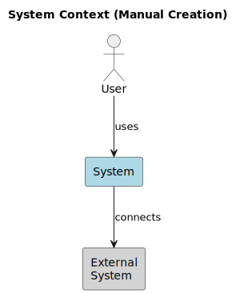
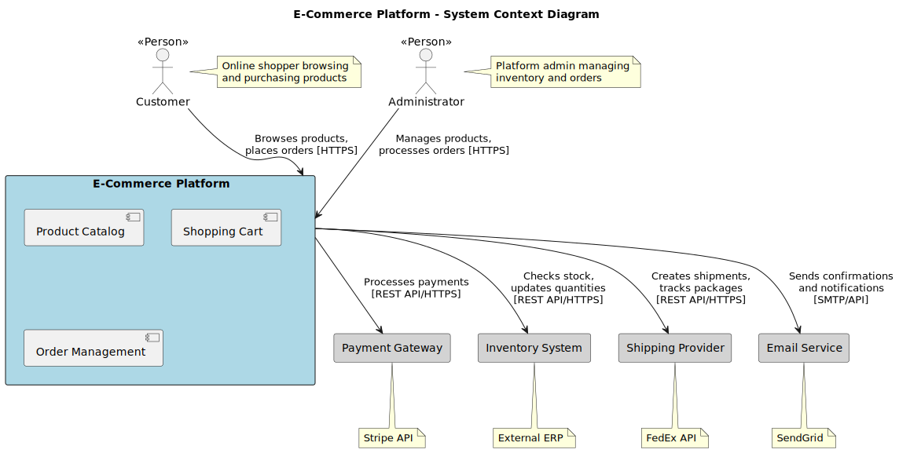
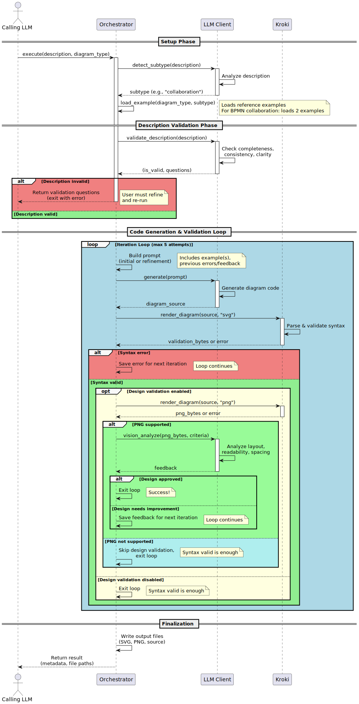

# diag-agent

An LLM Agent for creating software architecture diagrams with autonomous syntax validation and design feedback.

## Features

- 🤖 **Autonomous diagram generation** with syntax validation and design feedback loop
- ✅ **Smart description validation** - LLM checks descriptions for completeness and clarity before generation
- 🎨 **Multi-format support** via Kroki integration (PlantUML, C4, BPMN, Mermaid, etc.)
- 🚀 **Flexible deployment**: CLI tool, MCP server, or Python library
- 🔒 **Privacy-first**: Local-first approach with optional remote rendering
- 🔌 **LLM-agnostic**: Works with any LLM via LiteLLM (Anthropic, OpenAI, etc.)
- ⚡ **Context-efficient**: Minimal token consumption through optimized prompts

## Why Use diag-agent?

### Before: Manual Diagram Creation ❌

Creating diagrams manually means wrestling with syntax, debugging errors, and iterating repeatedly:

```bash
# Attempt 1: Write BPMN XML manually
$ vim order-process.bpmn
# ... 200 lines of XML later ...

# Attempt 2: Test with Kroki
$ curl -X POST https://kroki.io/bpmn/svg --data-binary @order-process.bpmn
# ❌ Error: "Syntax error at line 47: Missing closing tag"

# Attempt 3: Fix the error
$ vim order-process.bpmn
# ... fix line 47 ...

# Attempt 4: Test again
$ curl -X POST https://kroki.io/bpmn/svg --data-binary @order-process.bpmn
# ❌ Error: "Invalid reference: Flow_1 sourceRef not found"

# Attempt 5: Debug references
# ... 30 minutes later ...
# ❌ Still not working...
```

**Result**: Hours spent debugging syntax instead of designing architecture.

### After: With diag-agent ✅

Let the LLM handle syntax while you focus on architecture:

```bash
# Single command with natural language description
$ uv run diag-agent create \
  "BPMN collaboration with Customer and Shop pools. \
   Customer: submit order, receive confirmation. \
   Shop: receive order, process payment, ship product." \
  --type bpmn

# diag-agent automatically:
# 1. Validates your description for completeness ✓
# 2. Generates valid BPMN XML ✓
# 3. Validates syntax with Kroki ✓
# 4. Refines based on errors (if any) ✓
# 5. Checks design quality with vision LLM ✓

✓ Generated in 1 iteration (3.2s)
✓ Output: diagrams/order-process.bpmn, order-process.svg
```

**Result**: Valid, well-designed diagram in seconds—no syntax debugging required.

### Key Advantages

| Manual Creation | With diag-agent |
|----------------|-----------------|
| ❌ Hours of syntax debugging | ✅ Natural language description |
| ❌ Trial-and-error iterations | ✅ Autonomous validation loop |
| ❌ No design feedback | ✅ Vision-based quality checks |
| ❌ Format-specific expertise required | ✅ Works across 20+ diagram types |
| ❌ Manual refinement cycles | ✅ Self-healing error correction |

### Visual Comparison

<table>
<tr>
<td width="50%">

**Before: Manual Creation ❌**

Simple, unclear diagram with generic labels and no context:



*Issues: Vague relationships, no protocols, minimal context*

</td>
<td width="50%">

**After: With diag-agent ✅**

Professional diagram with clear relationships and detailed context:



*Improvements: Detailed descriptions, protocols specified, clear system boundaries*

</td>
</tr>
</table>

## How it Works

The orchestrator coordinates a feedback loop between the calling LLM and validation services:



**Key workflow steps:**

1. **Description Validation**: LLM checks your description for completeness and clarity
   - Invalid → Returns specific questions for refinement
   - Valid → Proceeds to generation

2. **Iterative Generation Loop** (max 5 iterations):
   - LLM generates diagram code from prompt
   - Kroki validates syntax by attempting to render
   - Optional: Vision LLM analyzes design quality (PNG-capable diagrams only)
   - On errors: Refines prompt with specific feedback

3. **Output**: Valid diagram in requested formats (source, SVG, PNG, PDF)

The workflow ensures high-quality diagrams through autonomous validation and refinement.

## Quick Start

### CLI Usage

```bash
# Clone the repository
git clone https://github.com/docToolchain/diag-agent.git
cd diag-agent

# Install locally
uv pip install .

# Configure API key
export ANTHROPIC_API_KEY=your_key_here

# Generate a diagram (using uv run - no venv activation needed)
uv run diag-agent create "C4 context diagram for API gateway"
```

### MCP Server (for Claude Desktop)

```bash
# Clone and install with MCP support
git clone https://github.com/docToolchain/diag-agent.git
cd diag-agent
uv pip install ".[mcp]"

# Add to Claude Desktop config (~/.config/Claude/claude_desktop_config.json)
{
  "mcpServers": {
    "diag-agent": {
      "command": "python",
      "args": ["-m", "diag_agent.mcp.server"],
      "env": {
        "ANTHROPIC_API_KEY": "your_key_here",
        "KROKI_URL": "http://localhost:8000"
      }
    }
  }
}
```

Then in Claude Desktop:
> "Create a C4 context diagram for an e-commerce platform"

### Docker

```bash
# Clone repository and build Docker image
git clone https://github.com/docToolchain/diag-agent.git
cd diag-agent
docker build -t diag-agent .

# Run with Docker
docker run --rm \
  -e ANTHROPIC_API_KEY=your_key_here \
  -v $(pwd)/diagrams:/diagrams \
  diag-agent \
  create "User authentication flow"

# Or use Docker Compose for full stack (CLI + Kroki)
docker-compose up -d kroki
docker-compose run --rm diag-agent-cli create "architecture diagram"

# MCP Server with Docker Compose
docker-compose --profile mcp up -d
```

See [User Guide - Docker Deployment](src/docs/user-guide.md#docker-deployment) for details.

## Documentation

- **[User Guide](src/docs/user-guide.md)** - Comprehensive reference with all CLI commands, configuration, and MCP setup
- **[Tutorial](src/docs/tutorial.md)** - Hands-on examples for different diagram types and use cases
- **[Architecture](src/docs/arc42/arc42.adoc)** - Technical architecture documentation (arc42)

## CLI Commands

```bash
# Generate diagrams
uv run diag-agent create "diagram description" [OPTIONS]

# Options:
#   --type TYPE        Diagram type (default: plantuml)
#   --output DIR       Output directory (default: ./diagrams)
#   --format FORMATS   Comma-separated formats: png,svg,pdf,source
#   --force, -f        Skip description validation

# Browse examples
uv run diag-agent examples list [--type TYPE]
uv run diag-agent examples show TYPE/NAME

# Manage local Kroki server
uv run diag-agent kroki start|stop|status|logs
```

### Description Validation

By default, diag-agent validates your description before generating diagrams. If the description is unclear or incomplete, you'll receive specific questions:

```bash
❌ Die Beschreibung enthält Unklarheiten:

1. Which type of BPMN diagram is needed? (process/collaboration/choreography)
2. Who performs the "approval step"? Specify role or system name.

Bitte rufe das Tool mit einer präziseren Beschreibung erneut auf.
Oder nutze --force um diese Validierung zu überspringen.
```

Use `--force` to skip validation when needed (e.g., for automated workflows or intentionally vague descriptions).

See [User Guide - CLI Commands](src/docs/user-guide.md#cli-commands) for detailed documentation.

## Supported Diagram Types

- **C4 Architecture**: `c4plantuml` - Context, Container, Component diagrams
- **UML**: `plantuml` - Sequence, Class, Component, Deployment, etc.
- **BPMN**: `bpmn` - Business processes and workflows
- **Mermaid**: `mermaid` - Flowcharts, Sequence, Gantt, etc.
- **Database**: `erd` - Entity Relationship Diagrams
- **And 20+ more** via [Kroki](https://kroki.io/#support)

See [Tutorial - Diagram Types](src/docs/tutorial.md) for practical examples.

## Installation

### Requirements

- **Python 3.10+** (for native installation)
- **Docker** (optional, for containerized deployment or local Kroki server)
- **LLM API key** (Anthropic, OpenAI, or other)
- **uv package manager** - [Install uv](https://docs.astral.sh/uv/)

### Local Installation (Recommended)

```bash
# Clone repository
git clone https://github.com/docToolchain/diag-agent.git
cd diag-agent

# Install locally
uv pip install .

# Or install with MCP server support
uv pip install ".[mcp]"

# Or install for development (editable mode)
uv pip install -e ".[dev,mcp]"
```

### Docker Installation

```bash
# Clone repository
git clone https://github.com/docToolchain/diag-agent.git
cd diag-agent

# Build image locally
docker build -t diag-agent .

# Run
docker run --rm \
  -e ANTHROPIC_API_KEY=your_key \
  -v $(pwd)/diagrams:/diagrams \
  diag-agent create "architecture diagram"
```

See [User Guide - Docker Deployment](src/docs/user-guide.md#docker-deployment) for full documentation.

## Configuration

Configure via environment variables or `.env` file:

```bash
# LLM Configuration
export LLM_PROVIDER=anthropic        # anthropic, openai, azure, etc.
export LLM_MODEL=claude-sonnet-4     # Model name
export ANTHROPIC_API_KEY=your_key    # API key

# Kroki Configuration
export KROKI_URL=http://localhost:8000  # Local or remote Kroki server

# Agent Configuration
export MAX_ITERATIONS=10             # Max LLM iterations
export ENABLE_DESIGN_FEEDBACK=true   # Enable design feedback loop
```

See [User Guide - Configuration](src/docs/user-guide.md#configuration) for all options.

## Examples

### Generate Different Diagram Types

```bash
# C4 Context Diagram
uv run diag-agent create "C4 context diagram for e-commerce platform" --type c4plantuml

# BPMN Process
uv run diag-agent create "Order fulfillment process" --type bpmn

# Mermaid Flowchart
uv run diag-agent create "CI/CD pipeline stages" --type mermaid

# Database Schema
uv run diag-agent create "User management database schema" --type erd
```

### Use Local Kroki Server

```bash
# Start local Kroki (requires Docker)
uv run diag-agent kroki start

# Generate diagram using local server
uv run diag-agent create "architecture diagram"

# Stop Kroki when done
uv run diag-agent kroki stop
```

### Custom Output

```bash
# Custom output directory and formats
uv run diag-agent create "System architecture" \
  --type c4plantuml \
  --output ./docs/architecture \
  --format svg,pdf,source
```

See [Tutorial](src/docs/tutorial.md) for step-by-step examples.

## Development

```bash
# Install development dependencies
uv pip install -e ".[dev,mcp]"

# Run tests
pytest

# Run tests with coverage
pytest --cov=diag_agent --cov-report=html

# Format code
black src tests
ruff check src tests

# Type checking
mypy src
```

## Contributing

Contributions welcome! See [CONTRIBUTING.md](CONTRIBUTING.md) for guidelines.

## License

MIT
